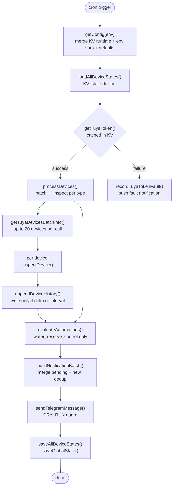

# Architecture

Condo Sentinel is a Cloudflare Worker that polls Tuya Cloud devices on a cron schedule, stores compact state/history in KV, sends Telegram alerts, and serves a dashboard SPA.

---

## Cron Flow



---

## HTTP Routes

```
GET  /                        → 302 redirect to /dashboard
GET  /dashboard               → HTML shell (no auth required, no data embedded)
GET  /api/status              → device snapshot (Bearer auth)
GET  /api/history?device=<id> → history points for one device (Bearer auth)
GET  /api/dashboard-context   → config + user + admin device list (Bearer auth)
POST /api/dashboard-context   → save runtime config + user mappings (admin only)
```

---

## Config Layers

```
Priority (highest → lowest):

┌─────────────────────────────────────┐
│  KV runtime config                  │  dashboard:runtime:config
│  (admin-set via /api/dashboard-     │  normalized by normalizeDashboardRuntimeConfig()
│   context POST)                     │
├─────────────────────────────────────┤
│  Environment variables              │  wrangler.toml [vars] or Cloudflare secrets
│  (deploy-time)                      │
├─────────────────────────────────────┤
│  DEFAULT_CONFIG                     │  hardcoded in src/config.js
│  (fallback)                         │
└─────────────────────────────────────┘
```

`getConfig(env)` merges all three layers. The resulting `cfg` object is the single source of truth for the duration of one worker execution.

---

## KV Key Schema

| Key | Type | Description |
|---|---|---|
| `state:device:<id>` | JSON object | Per-device alert state, last readings, timestamps. Shape: `createDefaultDeviceState()` in `state.js`. |
| `history:device:<id>` | JSON array | Ordered history points. Each point is typed (see `buildHistoryPoint()`). Capped at `HISTORY_MAX_POINTS`. |
| `condo_automation_state` | JSON object | Global state: `automations` map, `pendingNotifications[]`, `integrations.tuya`. |
| `tuya:access_token` | JSON object | Cached Tuya token: `{ token, expiresAt }`. Refreshed when within 60s of expiry. |
| `dashboard:runtime:config` | JSON object | Admin-editable config fields. Validated and clamped by `normalizeDashboardRuntimeConfig()`. |
| `dashboard:runtime:user-roles` | JSON array | Admin-managed user list: `[{ email, role }]`. Overrides `DASHBOARD_USERS_JSON` env var entries. |
| `access:jwks` | JSON object | Cached Cloudflare Access JWKS: `{ fetchedAt, jwks }`. TTL 1h; refreshed on unknown `kid`. Only used when CF Access JWT validation is enabled. |

### Legacy key
| `condo_automation_state` | also used | Global state was previously the only state store. `loadDeviceState()` migrates legacy device sub-keys on first read. |

---

## Auth Model

```
/dashboard (GET)
  └── No authentication. Returns static HTML shell only.
      No device data, no secrets, no user info embedded.

/api/* (all routes)
  └── requireDashboardAuth()
        reads Authorization: Bearer <token>
        compares with DASHBOARD_ACCESS_TOKEN using constantTimeEqual()
        returns 401 if missing/wrong, 503 if token not configured

      getDashboardUser()
        if CF_ACCESS_TEAM_DOMAIN + CF_ACCESS_AUD are configured:
          verifies the Cf-Access-Jwt-Assertion JWT (RS256) against the
          team JWKS (access.js); plain email headers are IGNORED
        else (legacy mode):
          reads CF-Access-Authenticated-User-Email header as-is
        looks up email in merged user list (env DASHBOARD_USERS_JSON + KV user-roles)
        returns { email, role: 'admin' | 'viewer' }

      Anti-lockout: POST /api/dashboard-context rejects a user list whose
      merged result (env + KV) would contain no admin.

Role effects:
  viewer → can call GET /api/status, GET /api/history, GET /api/dashboard-context
           receives empty devices[] and users[] from dashboard-context
  admin  → all viewer access + receives full device config + users list
           can POST /api/dashboard-context to save runtime config and user mappings
```

---

## Device Types

| Type | Alarm Fields | Battery | Level/State | Alert Types |
|---|---|---|---|---|
| `water_level_sensor` | — | `battery_percentage` | `liquid_level_percent`, `liquid_state` | low level, sensor fault, battery low, offline |
| `gas_sensor` | `gas_alarm`, `alarm`, `gas_state` | `battery_percentage`, `battery` | — | alarm, battery low, offline |
| `water_leak_sensor` | `watersensor_state`, `water_state`, `leak_state`, `alarm` | `battery_percentage`, `battery` | — | alarm, battery low, offline |
| `valve` | — | — | `switch_1` (configurable via `statusCode`) | offline |

All types also share: API fault alert (when Tuya batch or status call fails).

### water_level_sensor specific

Consecutive breach counting: `dState.breachCount` increments each check where `percent <= thresholdPercent`. Alert fires only after `minConsecutiveBreaches` consecutive breaches. Resets to 0 on recovery (`percent >= threshold + recoveryMarginPercent`).

Invalid readings (`getInvalidWaterLevelReadingReason`): fires `sensorFaultActive` if percent is missing, out of range, or `state` starts with `err_`.

---

## Notification Pipeline

```
notifications[]          ← accumulated during processDevices + evaluateAutomations
globalState.pendingNotifications  ← persisted failures from previous runs

1. removePendingNotificationsForRecoveries()
   — if a recovery message was produced this run,
     remove the matching fault from pending (by string prefix)

2. buildNotificationBatch()
   — split pending into due (nextAttemptAt <= now) and deferred
   — concat: due pending messages + new notifications[]
   — dedupeNotifications() via Set

3. sendTelegramMessage()
   — if send fails: messages go back into pending with nextAttemptAt = now + faultCooldownMs
   — if send succeeds: pending cleared to deferred-only

4. saveGlobalState() always runs (finally block)
```

---

## Dashboard Frontend

The dashboard is a SPA bundled as an inline string by `dashboard-js.js`. It fetches `/api/status` for device state, `/api/history?device=<id>` for chart data, and `/api/dashboard-context` for config and user context.

Session management uses `sessionStorage` (not `localStorage`). Token stored under `condoSentinel.dashboardToken`, last activity under `condoSentinel.lastActivityAt`. Session expires after `DASHBOARD_SESSION_TIMEOUT_MINUTES` of inactivity.

Chart rendering uses Chart.js loaded from `cdn.jsdelivr.net` (declared in CSP).
